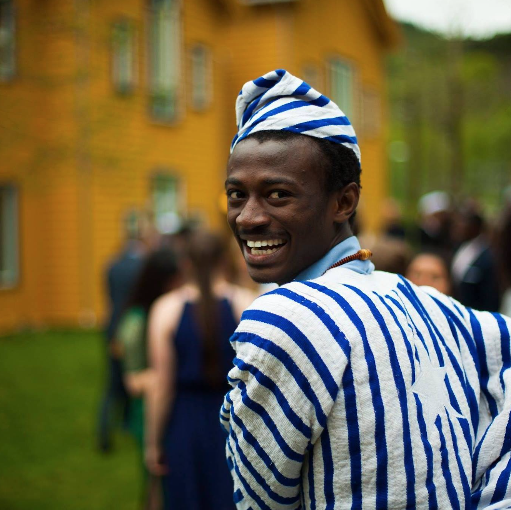

# Bruno Felalaga

📞 +1-708-5175-666 | 📧 [brunofelalaga@uchicago.edu](mailto:brunofelalaga@uchicago.edu) | [LinkedIn](https://www.linkedin.com/in/bruno-felalaga/) | [GitHub](https://github.com/BrunoFelalaga)

# About Me

I am a motivated Software Engineer with a background in Electrical and Computer Engineering. I am passionate about leveraging AI/ML to build Software Solutions for problems that affect communities at scale.

Currently, I am studying for a Masters Degree in Computer Science at the University of Chicago and looking to graduate in March of 2025. 

I am also actively looking for related full-time opportunities. Please reach out with any ideas for collaborations or open relevant roles. 
I am also happy to discuss my journey, background and qualifications!

## Education

**The University of Chicago**  
*MSc Computer Science* — Chicago, IL  
**Expected:** March 2025  
**Relevant Coursework:** Algorithms, Cloud Computing, Applied Data Analytics, Unix Systems, Python Programming, DataBase Systems

**Brown University**  
*BSc Electrical Engineering* — Providence, RI  
**Graduated:** May 2021  
**Relevant Coursework:** Data Structures & Algorithms, OOP, Digital Electronic Systems Design, Linear System Analysis  
**Awards:** Wade Scholar, Brown UTRA Award, Brown LINK Award, Shoman Scholar, Davis Scholar, Davis Projects for Peace

## Skills

**Languages:**
Python | Java | JavaScript | C/C++ | SQL | NoSQL | UNIX

**Frameworks & Tools:**
TensorFlow | Pytorch | YOLO | OpenCV | Docker | Spark | AWS/GCP/AZURE | Google Drive SDK | Debian Alpine Linux

## Professional Experience
**Software Engineering Intern**  
*PicAxe* — Chicago, IL  
**June - September 2024**  
- Developed software to identify and extract images from scanned PDF documents, achieving an impressive F1 score of **0.96**, improving performance by **10%**.
- Fine-tuned the **YOLOv8 object detection model** to efficiently perform image extraction, achieving an F1 score of **0.99** with a runtime of **0.7s per image**, significantly enhancing speed.
- Scripted processes to seamlessly upload and download **20GB+ of image data** to and from **Google Drive** without crashes, ensuring smooth data handling.
- Automated the comparison of extracted images against original PDFs and generated **Excel reports** with detailed counts and statistics for analysis.
- Implemented a **template matching script** to accurately align manually extracted images with their respective document pages and retrieve their bounding boxes.
- Utilized bounding box data to create custom datasets for fine-tuning the **YOLOv8 model** for more precise object detection.
- Built a **lightweight Docker image** for the software distribution, reducing size to **500MB** by using **Debian Alpine Linux** for minimal resource usage.

**Software Engineer**  
*Goteff Superfoods* — Providence, RI  
**Jul 2021 - Aug 2022**  
- Enhanced customer retention by optimizing payment and delivery processes.
- Implemented Stripe API with webhook endpoints and tokenization for secure payments.
- Leveraged AWS S3 for image hosting and auto-scaling, achieving a low latency of ~90ms.
- Developed REST APIs with Express.js to synchronize data between admin and user interfaces.

**Attitude Dynamics Lead**  
*Brown U. Space Engineering, USC* — Los Angeles, CA  
**Jan 2020 - May 2021**  
- Designed and prototyped a cubesat robotic arm for satellite health sensing, to be deployed at the ISS in 2025.
- Implemented B-dot Controller algorithm for magnetorquers, replacing passive hysteresis rods.
- Simulated the inertia matrix of the cubesat to optimize control parameters and hardware selection.
- Synchronized arm motion with attitude using a PID control algorithm, increasing pointing accuracy by 27%.

**Medical Imaging Research Assistant**  
*Lee Biomed-Optics Lab* — Providence, RI  
**Nov 2017 - Dec 2019**  
- Analyzed the viability of 3D liver spheroids using label-free Optical Coherence Tomography.
- Reconstructed 3D maps of diffusion coefficients in MATLAB to correlate intracellular motility with viability.
- Trained a CNN ML model with imaging data, achieving 94% accuracy in detecting spheroid deterioration.
- Co-authored a publication on pH and temperature effects on tissue health and deterioration.

**Infectious Diseases Research Assistant**  
*Korle-Bu Teaching Hospital* — Accra, GH  
**Jan - Dec 2017**  
- Led a 5-year retrospective study on TB/HIV co-infection therapy adherence.
- Developed a scalable, centralized, digitized patient database, synchronizing updates from clinics.
- Implemented REST API endpoints for data transfer among frontend, backend, and database.
- Made recommendations that improved therapy adherence by ~32% based on statistical regression analysis.

## Projects

**Geospatial Data Processing**  
*UChicago TechTeam & Genesys Work*  
**Sept 2023 - Present**  
- Mentoring undergraduates on software and data strategies for non-profit firms in Chicago.
- Creating a platform for pairing high school students with internships in Chicago.
- Integrating Google Maps API to streamline location pairing using GPS data and zip codes.
- Developing algorithms to optimize transit times and utilizing Power BI for data visualization.

**Virtual Book Club - Group Project**  
*UChicago*  
**June 2023 - Present**  
- Leading the development of an end-to-end social platform with FastAPI for book reading and discussion.
- Executed CRUD operations, integrated authentication, and managed relational database structures.
- Integrated CI/CD pipelines for automated testing across various platforms.
- Tested the platform with ~20 users and continuously incorporated user feedback.

## Leadership and Engagement

**Founder**  
*Davis Foundation Community & Lib. & IT Center* — UER, Ghana  
**Feb 2018 - Present**  
- Won a $10,000 award to establish a solar-powered library and IT center for ~6K off-grid residents.
- Improved school retention rates by 55% by introducing educational tools like Kahoot, Nearpod, and Scratch.

**Activities:** UChicago TechTeam, Derivatives of Data Science, Brown Space Engineering, Brown CS Mosaic+, NSBE  
**Leadership:** Algorithms TA - UChicago, UChicago TeachTeam Mentor, Chemical Equilibriums TA - Brown U.
