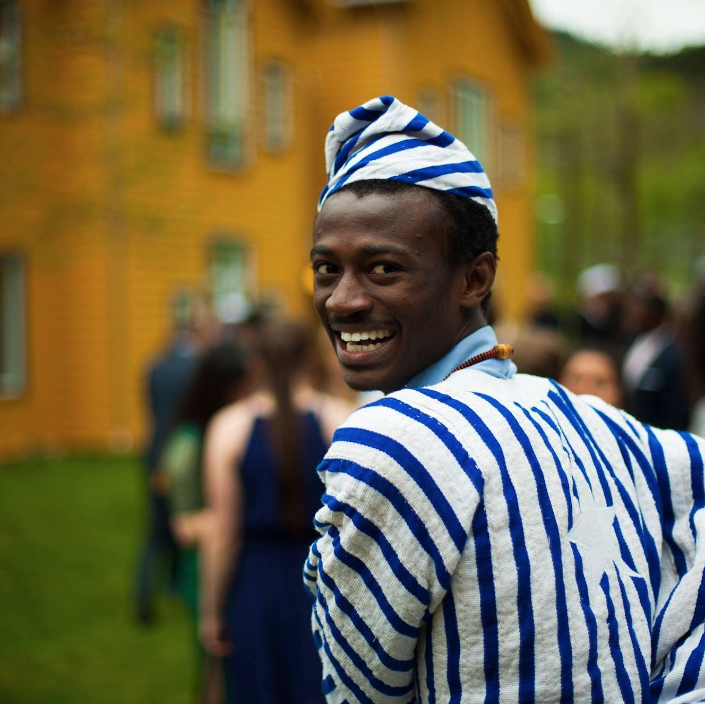

# About Me

I am a motivated Software Engineer with a background in Electrical and Computer Engineering. I am passionate about leveraging AI/ML to build Software Solutions for problems that affect communities at scale.

Currently, I am studying for a Masters Degree in Computer Science at the University of Chicago and looking to graduate in March of 2025.

I am actively looking for related full-time opportunities. Please reach out with any ideas for collaborations or open relevant roles. I am also happy to discuss my journey, background, and qualifications!

